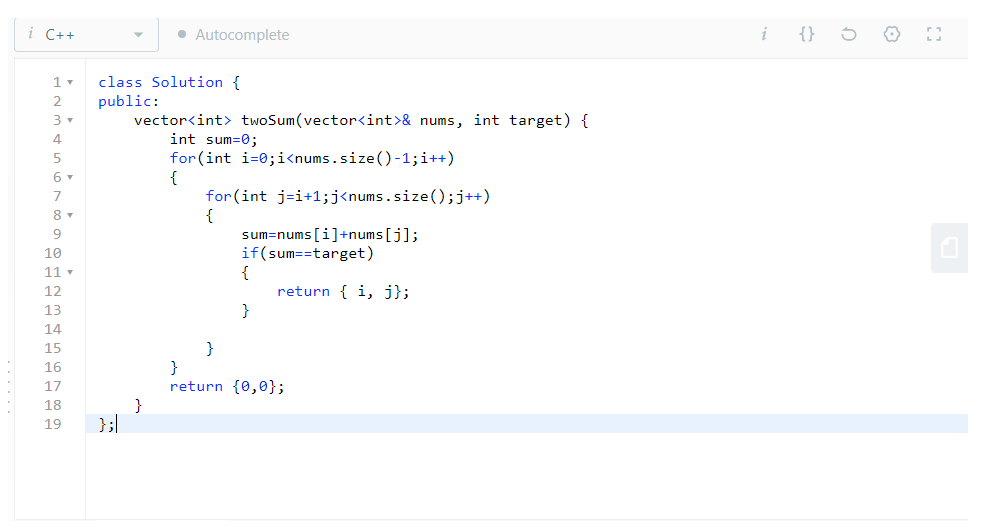

## #1 Two Sum
### Approach 1 (takes more time but less space)
1. Make a sum variable.
2. Store the size of the vector for convenience.  
3. Make 2 nested for loops, let's say the outer one to start from 0 till size-2 and inner loop to start from i till size-1.
4. Inside the inner loop store the sum of entries in ith and jth postitions of the array and compapre the sum to the target value
5. If the conditions are met return { i, j}
6. Else let the function return { 0, 0} at the end;
